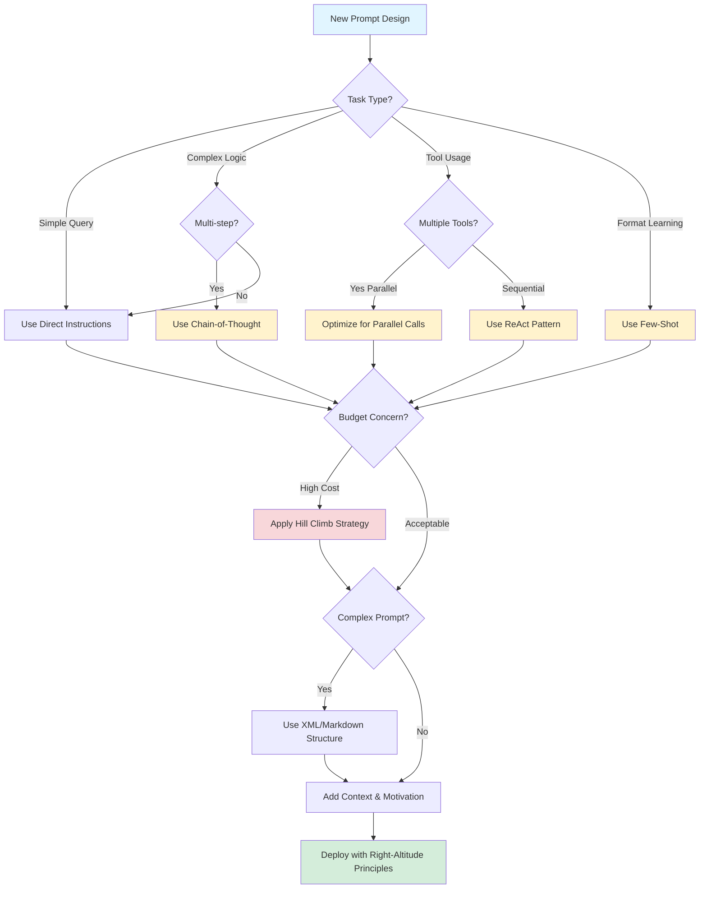

# Prompt Engineering Best Practices

A comprehensive guide to prompt engineering techniques for Claude 4.5 and general LLM development.

---

## Table of Contents

1. [Quick Decision Tree](#quick-decision-tree)
2. [Claude 4.5 Specific Best Practices](#claude-45-specific-best-practices)
   - [Be Explicit with Instructions](#be-explicit-with-instructions)
   - [Add Context and Motivation](#add-context-and-motivation)
   - [Optimize for Parallel Tool Calling](#optimize-for-parallel-tool-calling)
   - [Communication Style Adaptation](#communication-style-adaptation)
   - [Context Awareness Prompting](#context-awareness-prompting)
   - [Right-Altitude Prompting](#right-altitude-prompting)
3. [Advanced Techniques](#advanced-techniques)
   - [Structured Prompting with XML/Markdown](#structured-prompting-with-xmlmarkdown)
   - [Chain-of-Thought (CoT) Prompting](#chain-of-thought-cot-prompting)
   - [Few-Shot Prompting](#few-shot-prompting)
   - [ReAct (Reasoning + Acting)](#react-reasoning--acting)
   - [Cost-Quality Tradeoff: Hill Climb Strategy](#cost-quality-tradeoff-hill-climb-strategy)
4. [References](#references)

---

## Quick Decision Tree



**Decision Heuristics:**
- **Simple Query**: Factual Q&A, translation, summarization → Direct instructions
- **Complex Logic**: Math, debugging, multi-step reasoning → Chain-of-Thought
- **Tool Usage (Parallel)**: Multiple independent operations → Parallel tool optimization
- **Tool Usage (Sequential)**: Agent workflow with dependencies → ReAct pattern
- **Format Learning**: Specific output structure needed → Few-Shot examples
- **High Cost**: Running expensive prompts at scale → Hill Climb strategy
- **Complex Prompts**: Multiple sections/roles/contexts → XML/Markdown structure

---

## Claude 4.5 Specific Best Practices

### Be Explicit with Instructions

**Principle**: Claude 4.5 responds literally to instructions. Ambiguity leads to suggestions rather than actions.

**Evidence**: [Claude 4 Best Practices](https://platform.claude.com/docs/en/build-with-claude/prompt-engineering/claude-4-best-practices)

**Example**:
```text
# Less effective:
Create an analytics dashboard

# More effective:
Create an analytics dashboard. Include as many relevant features and 
interactions as possible. Go beyond the basics to create a fully-featured 
implementation.
```

**When to Use**:
- Agent workflows requiring autonomous action
- Code generation where comprehensive implementation is needed
- Any task where "suggestions" are insufficient

**When NOT to Use**:
- Brainstorming sessions (where suggestions are desired)
- Exploratory conversations (where options are valuable)

---

### Add Context and Motivation

**Principle**: Explaining *why* helps Claude understand goals and deliver targeted responses.

**Evidence**: [Claude 4 Best Practices](https://platform.claude.com/docs/en/build-with-claude/prompt-engineering/claude-4-best-practices)

**Excerpt**:
> "Providing context or motivation behind your instructions, such as explaining to Claude why such behavior is important, can help Claude 4.5 models better understand your goals and deliver more targeted responses."

**When to Use**:
- Domain-specific tasks (explain domain constraints)
- Multi-step workflows (explain end goal)
- Edge case handling (explain why edge cases matter)

**When NOT to Use**:
- Simple, self-explanatory tasks (adds unnecessary tokens)
- Well-defined standard operations (e.g., "format JSON")

---

### Optimize for Parallel Tool Calling

**Claude 4.5 Characteristic**: Aggressive parallel tool execution.

**Evidence**: [Claude 4 Best Practices](https://platform.claude.com/docs/en/build-with-claude/prompt-engineering/claude-4-best-practices)

**Excerpt**:
> "Claude 4.x models excel at parallel tool execution, with Sonnet 4.5 being particularly aggressive in firing off multiple operations simultaneously."

**Optimization Prompt**:
```text
<use_parallel_tool_calls>
If you intend to call multiple tools and there are no dependencies between the 
tool calls, make all of the independent tool calls in parallel. Prioritize calling 
tools simultaneously whenever the actions can be done in parallel rather than 
sequentially. Maximize use of parallel tool calls where possible to increase speed 
and efficiency.
</use_parallel_tool_calls>
```

**When to Use**:
- Batch operations (read multiple files, query multiple APIs)
- Independent data fetching (search + database lookup)
- Any scenario where operations don't depend on each other's results

**When NOT to Use**:
- Sequential workflows (next step needs previous result)
- Rate-limited APIs (parallel calls may trigger throttling)
- Operations with shared state (race conditions)

---

### Communication Style Adaptation

**Claude 4.5 Characteristics**:

**Evidence**: [Claude 4 Best Practices](https://platform.claude.com/docs/en/build-with-claude/prompt-engineering/claude-4-best-practices)

**Excerpt**:
> "Claude 4.5 models have a more concise and natural communication style compared to previous models:
> - **More direct and grounded**: Provides fact-based progress reports
> - **More conversational**: Slightly more fluent and colloquial, less machine-like
> - **Less verbose**: May skip detailed summaries for efficiency unless prompted otherwise"

**Implication**: Request detailed explanations explicitly if needed for documentation or user-facing outputs.

**When to Use Verbose Instructions**:
- Documentation generation (need comprehensive explanations)
- User-facing outputs (need detailed reasoning)
- Teaching/tutorial contexts (need step-by-step breakdown)

**When to Accept Concise Defaults**:
- Internal tools/scripts (efficiency over explanation)
- Rapid prototyping (speed over documentation)
- Agent-to-agent communication (reduce token usage)

---

### Context Awareness Prompting

**For Long-Horizon Tasks**:

**Evidence**: [Claude 4 Best Practices](https://platform.claude.com/docs/en/build-with-claude/prompt-engineering/claude-4-best-practices)

**Excerpt**:
```text
Your context window will be automatically compacted as it approaches its limit, 
allowing you to continue working indefinitely from where you left off. Therefore, 
do not stop tasks early due to token budget concerns. As you approach your token 
budget limit, save your current progress and state to memory before the context 
window refreshes. Always be as persistent and autonomous as possible and complete 
tasks fully, even if the end of your budget is approaching.
```

**When to Use**:
- Long implementation tasks (multi-file refactors)
- Research workflows (extensive codebase exploration)
- Iterative development (multiple rounds of feedback)

**When NOT to Use**:
- Simple, short tasks (adds unnecessary instructions)
- Stateless operations (no continuity needed)

---

### Right-Altitude Prompting

**Principle**: Heuristics over hardcoded logic, boundaries over micromanagement.

**Evidence**: [Effective Context Engineering for AI Agents](https://www.anthropic.com/engineering/effective-context-engineering-for-ai-agents)

**Bad (Too Low)**: Hardcoded if-else
```text
If user says 'refund', check if order_date < 30 days, 
then if amount > $100, escalate to manager, else...
```

**Bad (Too High)**: Vague instructions
```text
Be helpful and answer questions about orders.
```

**Good (Right Altitude)**: Heuristics + clear boundaries
```text
You are a customer support agent.

<guidelines>
- Verify order details before processing refunds
- Escalate requests over $100 to human review
- Use tools to check eligibility, don't guess
</guidelines>

<tools>
- check_refund_eligibility(order_id)
- escalate_to_human(reason)
</tools>
```

**When to Use**:
- Agent systems (need autonomy with guardrails)
- Customer-facing applications (balance flexibility and safety)
- Complex workflows (avoid brittle hardcoded logic)

**When NOT to Use**:
- Strict compliance scenarios (need explicit rules)
- Safety-critical systems (cannot tolerate interpretation)
- Simple deterministic tasks (overhead not justified)

---

## Advanced Techniques

### Structured Prompting with XML/Markdown

**Principle**: Use clear section markers for complex prompts.

**Evidence**: [The Prompt Report](https://arxiv.org/abs/2406.06608)

**Verified Pattern**:
```markdown
<role>Technical support specialist</role>

<context>
User: {user_name} | Tenure: {user_tenure}
Top complaint categories: {complaint_history}
</context>

<instructions>
1. Greet user by name
2. Ask clarifying questions before offering solutions
3. Use search_knowledge_base() for technical issues
4. Escalate if unresolved after 3 attempts
</instructions>
```

**When to Use**:
- Multi-section prompts (role + context + instructions + examples)
- Agent system prompts (clear separation of concerns)
- Complex workflows (readability and maintainability)

**When NOT to Use**:
- Simple single-instruction prompts (adds overhead)
- Creative writing prompts (structure may constrain creativity)

---

### Chain-of-Thought (CoT) Prompting

**When to Use**:
- Multi-step reasoning (math, logic)
- Complex decision trees
- Debugging/root cause analysis

**When NOT to Use**:
- Simple factual questions (adds latency)
- Creative writing (constrains exploration)
- Models with built-in reasoning (o1, o3)

**Evidence**: [DAIR.AI Prompting Guide](https://www.promptingguide.ai/)

**Verified Example**:
```markdown
Q: If John has 5 apples and gives 2 to Mary, then buys 3 more, how many does he have?
A: Let's solve this step-by-step:
1. John starts with 5 apples
2. He gives 2 to Mary: 5 - 2 = 3 apples remaining
3. He buys 3 more: 3 + 3 = 6 apples
Therefore, John has 6 apples.
```

---

### Few-Shot Prompting

**Principle**: Show 3-5 examples of desired output format.

**Evidence**: [DAIR.AI Prompting Guide](https://www.promptingguide.ai/)

**Pattern**:
```text
Task: Classify sentiment as positive, negative, or neutral.

Example 1:
Input: "I love this product!"
Output: positive

Example 2:
Input: "This is the worst purchase ever."
Output: negative

Example 3:
Input: "The item arrived on time."
Output: neutral

Now classify:
Input: "Pretty good, but could be better."
Output:
```

**When to Use**:
- Custom output formats (JSON schemas, domain-specific structures)
- Nuanced classification tasks (sentiment, intent, category)
- New model fine-tuning baseline (establish format before training)

**When NOT to Use**:
- Well-known formats (JSON, CSV - model already knows)
- Zero-shot capable tasks (adds cost without benefit)
- Very long examples (token budget constrained)

---

### ReAct (Reasoning + Acting)

**Principle**: Interleave thought process with tool usage.

**Evidence**: [DAIR.AI Prompting Guide](https://www.promptingguide.ai/)

**Pattern**:
```markdown
Thought: I need to find the capital of France
Action: search("capital of France")
Observation: Paris is the capital of France
Thought: Now I have the answer
Answer: The capital of France is Paris
```

**When to Use**:
- Agent workflows (multi-step tool usage)
- Complex problem-solving (research, analysis, implementation)
- Explainability required (audit trail of reasoning)

**When NOT to Use**:
- Simple tool calls (overhead not justified)
- Real-time applications (adds latency)
- Models with native agent capabilities (Claude already does this internally)

---

### Cost-Quality Tradeoff: Hill Climb Strategy

**Phase 1: Climb Up Quality**
1. Start with most capable model (GPT-5, Claude Opus 4.5)
2. Write detailed, verbose prompts
3. Build comprehensive eval suite
4. Achieve target accuracy (e.g., 95%)

**Phase 2: Descend Cost**
1. Try smaller models (GPT-4o, Claude Sonnet 4.5)
2. Simplify prompts (remove redundant instructions)
3. Constrain outputs (JSON schemas, shorter responses)
4. Run evals - if accuracy drops <2%, keep optimization
5. Iterate until cost/quality balanced

**Evidence**: [Prompt Engineering Industry Analysis](https://www.news.aakashg.com/p/prompt-engineering)

**Real-World Example**:
- **Bolt**: 2,500 token prompt, $0.03/call, $3,000/day (100K calls)
- **Cluely**: 212 token prompt, $0.00706/call, $706/day (100K calls)
- **Cost Reduction**: 76% through prompt engineering alone

**When to Use**:
- Production systems at scale (cost matters)
- Iterative product development (start quality, optimize cost)
- A/B testing scenarios (establish baseline, then experiment)

**When NOT to Use**:
- Prototyping phase (premature optimization)
- Low-volume applications (savings negligible)
- Safety-critical systems (quality cannot be compromised)

---

## References

1. **Claude 4 Best Practices** - Anthropic Official Documentation  
   https://platform.claude.com/docs/en/build-with-claude/prompt-engineering/claude-4-best-practices

2. **Effective Context Engineering for AI Agents** - Anthropic Engineering Blog  
   https://www.anthropic.com/engineering/effective-context-engineering-for-ai-agents

3. **The Prompt Report: A Systematic Survey** - arXiv (2024)  
   https://arxiv.org/abs/2406.06608

4. **DAIR.AI Prompting Guide** - Comprehensive Open-Source Guide  
   https://www.promptingguide.ai/

5. **Prompt Engineering Industry Analysis** - Aakash Gupta  
   https://www.news.aakashg.com/p/prompt-engineering

---

**Last Updated**: 2026-01-17  
**Source**: [OpenCode Skills and Agent Development Research](../../../thoughts/shared/research/2026-01-17-OpenCode-Skills-and-Agent-Development.md:597-817)
