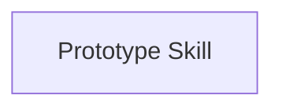
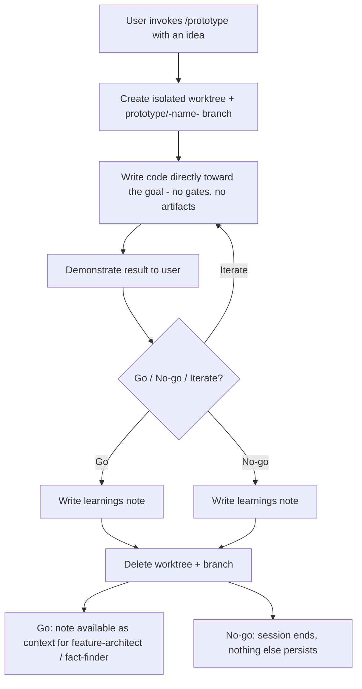

# Epic: Prototype Skill

## Specification Reference

**Source**: `thoughts/shared/features/2026-07-24-Prototype-Skill.md`

> Note: This is a brownfield feature (per `CLAUDE.md`'s brownfield pipeline: `/feature-architect → /epic-planner → /fact-finder → /planner → /implement`). There is no separate spec document — the feature brief produced by `/feature-architect` is the upstream artifact for this epic, consistent with `thoughts/shared/AGENTS.md`'s directory-assignment table (`features/` is written by `/feature-architect`, read by `/epic-planner`).

**Related Feature Brief Sections**:
- Essential Capability 1: Isolated, disposable execution environment
- Essential Capability 2: Full-speed coding with no pipeline gates
- Essential Capability 3: Show, then ask — explicit go/no-go conclusion
- Essential Capability 4: Learnings handoff and guaranteed cleanup
- Integration Points: `feature-architect`/`fact-finder` handoff, `thoughts/shared/AGENTS.md` registration, Agent tool `isolation: "worktree"` reuse, `CLAUDE.md` pipeline table update

**Mission Capability** (original):
Not applicable — this is a framework-internal tooling feature (a new skill added to the ORBIT pipeline itself), not a feature of an end-user product with its own mission document. The feature brief's own "Feature Vision" section stands in for mission context: `/prototype` is the pipeline's pressure-release valve for "would this even work?" questions, sitting alongside `mission-architect`, `feature-architect`, and the direct `fact-finder → planner` path.

## Epic Summary

This epic delivers the complete `/prototype` skill: a new `.claude/skills/prototype/SKILL.md` that lets a user spike a rough idea into working, disposable code inside an isolated git worktree, see it demonstrated, and reach an explicit go/no-go/iterate decision — with a durable learnings note surviving even though the code itself never does.

**Value**: Users get a fast, zero-consequence way to answer "would this even work?" without derailing the main pipeline with throwaway commits or half-specified artifacts, and without stepping outside the framework to hack something together unrecorded.

**Scope**: Includes the full skill lifecycle — worktree/branch creation, gate-free coding inside it, the demonstrate-then-decide loop (including "iterate" continuing in the same worktree), the learnings note and its `thoughts/shared/prototypes/` directory (with DOX registration), unconditional cleanup, and documentation of `/prototype` in `CLAUDE.md`'s pipeline table. Does NOT include: any spec/plan/QA artifact generation for the prototype itself, any code quality or spec-compliance review of prototype code, DOX/AGENTS.md contract enforcement inside the prototype worktree, or carrying prototype code forward on a "go" decision.

## User Stories

1. **Story: Isolated prototype workspace**
   - **As a** user with a rough idea
   - **I want to** invoke `/prototype` and have a fresh, disposable git worktree and branch created automatically
   - **So that** my exploratory code is physically separated from my main working tree and branch from the first line written

2. **Story: Gate-free coding**
   - **As a** user spiking an idea
   - **I want to** have the skill write code directly toward my stated goal inside the prototype worktree, with no mission/spec/plan artifacts, no DOX/AGENTS.md contract reads, and no `clean-code`/`typescript-qa`/`python-qa`/`logic-bugs-qa` review passes
   - **So that** I get maximum speed of learning, unencumbered by the rigor the rest of the pipeline exists to enforce

3. **Story: Show, then ask**
   - **As a** user who just had a prototype built
   - **I want to** see the prototype's result demonstrated (run, output shown, or equivalent) before being asked anything
   - **So that** I can make an informed go/no-go/iterate call instead of deciding blind

4. **Story: Explicit go/no-go/iterate decision**
   - **As a** user evaluating a demonstrated prototype
   - **I want to** be explicitly asked whether to proceed for real, discard and stop, or keep iterating
   - **So that** the prototype never lingers in an ambiguous, half-finished state

5. **Story: Iteration without re-setup**
   - **As a** user who chooses "keep iterating"
   - **I want to** continue working in the same worktree/branch without it being recreated or torn down
   - **So that** iterating is cheap and stays within the same session

6. **Story: Guaranteed cleanup**
   - **As a** user who reaches any final decision (go, no-go, or ends the session)
   - **I want to** have the worktree and branch unconditionally deleted at conclusion
   - **So that** "disposable" is a guarantee, not something I have to remember to clean up myself

7. **Story: Durable learnings, disposable code**
   - **As a** user who just finished a `/prototype` session
   - **I want to** have a short learnings note (problem, what was built, outcome, decision) written to `thoughts/shared/prototypes/` regardless of outcome
   - **So that** the decision and its rationale persist as framework knowledge even though the code is gone

8. **Story: Clean handoff to real implementation**
   - **As a** user who reached a "go" decision
   - **I want to** have the learnings note available as context input the next time I invoke `feature-architect` or `fact-finder`
   - **So that** real implementation starts clean through the normal pipeline instead of continuing from throwaway code

## System Behaviors (Technical Stories)

- **Behavior**: The skill must never touch the user's main working tree or currently checked-out branch at any point during execution (creation, coding, iteration, or cleanup).
  - **Why**: This is a hard isolation guarantee per the feature brief's Operational Constraints — without it, "disposable" and "consequence-free" are not actually true.
- **Behavior**: The `thoughts/shared/prototypes/` directory must be registered in `thoughts/shared/AGENTS.md` (directory-assignment table row + Child DOX Index entry), following the same pattern as `features/`, `facts/`, `qa/`.
- **Behavior**: `CLAUDE.md`'s pipeline table must document `/prototype` as a fourth, optional "explore first" branch alongside the greenfield, brownfield, and small-change flows — a documentation-only integration, not a behavioral dependency.

## Research Questions for Fact-Finder

These questions should be answered before planning implementation:

### Codebase Context
- [ ] What exactly does the Agent tool's `isolation: "worktree"` option do — is it scoped to a single agent invocation, or can it back a multi-turn "build, show, ask, iterate" loop spanning an entire skill's duration? Does its "auto-remove if unchanged" cleanup behavior risk discarding a prototype worktree that legitimately has uncommitted changes?
- [ ] If `isolation: "worktree"` does not fit a multi-turn skill session, what are the exact `git worktree add` / `git worktree remove` / branch-creation and branch-deletion commands the skill should issue directly, and from what starting state (detached HEAD vs. named base branch)?
- [ ] What is the precise current structure of `thoughts/shared/AGENTS.md` — the directory-assignment table and Child DOX Index — so the `prototypes/` entry matches the exact format used for `features/`, `facts/`, `qa/`?
- [ ] How do existing `SKILL.md` files structure conversational patterns (e.g. `AskUserQuestion` usage, multi-turn loops) — is there a precedent for "ask user a go/no-go/iterate question, then branch behavior" that `/prototype` should follow for consistency?
- [ ] Are there existing examples in `.claude/skills/*/SKILL.md` of a skill invoking `git worktree` commands directly via Bash (as opposed to only ever going through the Agent tool's `isolation: "worktree"`), to determine the right level (skill-level Bash vs. Agent-tool isolation) for this skill's cleanup guarantee?
- [ ] What is the exact current structure of the pipeline table and surrounding prose in `CLAUDE.md` (the "Workflow Pipeline" section), so the `/prototype` addition matches existing formatting?
- [ ] What frontmatter/section structure do other `SKILL.md` files use (e.g. `feature-architect`, `fact-finder`) as a formatting reference for the new `prototype/SKILL.md`?
- [ ] How does `feature-architect`'s (and `fact-finder`'s) Phase 1 context-loading step currently read prior artifacts (e.g. mission/spec documents), so the learnings-note handoff can be wired in using the same mechanism rather than a new one?

### External Knowledge
- [ ] None identified — this epic is entirely about composing existing framework mechanisms (skills, worktree isolation, `thoughts/shared/` conventions), not adopting new external libraries or patterns.

### Constraints & Risks
- [ ] What happens if the user closes the session (or the conversation ends) mid-prototype without reaching an explicit go/no-go/iterate decision — is there any existing pattern in this framework for guaranteeing cleanup runs even on abnormal termination, or is "cleanup happens once the user is done" inherently best-effort in that case?
- [ ] Does the Agent tool's worktree isolation (or manual `git worktree` usage) have any interaction with uncommitted changes already present in the user's main working tree at the time `/prototype` is invoked (e.g. does creating a new worktree require a clean main tree)?

**Output Expected**: Fact report in `thoughts/shared/facts/2026-07-24-Prototype-Skill.md`

## Acceptance Criteria for Planner

When this epic is complete, the following must be true:

### Functional Criteria (User-Facing)
- [ ] Invoking `/prototype` with a rough idea creates an isolated git worktree on a disposable `prototype/<name>` branch and produces working, runnable code the user can inspect and try.
- [ ] No mission/feature/spec/epic/fact/plan artifact is created for the prototype itself, and no `clean-code`/`typescript-qa`/`python-qa`/`logic-bugs-qa` review is invoked during the session.
- [ ] After building, the skill demonstrates the result (runs it, shows output, or equivalent) before asking anything.
- [ ] The skill explicitly asks the user to choose go / no-go / iterate, and "iterate" resumes work in the same worktree without recreating it.
- [ ] After the session concludes (any of the three outcomes), the worktree and branch are fully deleted — `git worktree list` and `git branch` show no trace of them, and the user's main working tree and previously-checked-out branch are unaffected throughout.
- [ ] A learnings note exists in `thoughts/shared/prototypes/YYYY-MM-DD-<name>.md` after every run, containing at minimum: problem, what was built, outcome, and decision.
- [ ] On a "go" decision, the next invocation of `feature-architect` or `fact-finder` can be pointed at the learnings note and use it as context, the same way those skills already consume mission/spec documents in their Phase 1 context-loading step.

### Technical Criteria (System-Level)
- [ ] `thoughts/shared/AGENTS.md`'s directory-assignment table and Child DOX Index include a `prototypes/` row/entry matching the existing pattern.
- [ ] `CLAUDE.md`'s "Workflow Pipeline" section documents `/prototype` as a fourth, optional branch alongside greenfield/brownfield/small-change.
- [ ] The isolation mechanism used (Agent tool `isolation: "worktree"` or direct `git worktree` commands) is confirmed via fact-finding to correctly support a multi-turn session and to never silently discard a worktree with real uncommitted changes.

### Quality Criteria (Testing/Verification)
- [ ] Manual verification demonstrates the full lifecycle end-to-end at least once: invoke → build → demonstrate → iterate at least once → reach a decision → confirm cleanup.
- [ ] Manual verification confirms a "no-go" run leaves zero trace beyond the learnings note (checked via `git status`/`git worktree list` on the main tree).
- [ ] Manual verification confirms the main working tree's checked-out branch and uncommitted state are unchanged before and after a `/prototype` session.

**Output Expected**: Implementation plan(s) in `thoughts/shared/plans/2026-07-24-Prototype-Skill-*.md`

## Dependencies

### Prerequisite Epics (MUST be complete before this epic)
- None. This is the first epic for this feature, and it depends only on existing framework mechanisms (Agent tool worktree isolation, `thoughts/shared/` conventions, `SKILL.md` structure) that already exist in the codebase.

### Concurrent Epics (CAN be developed in parallel)
- None currently planned.

### Dependent Epics (BLOCKED until this epic is complete)
- None currently planned. Future epics that want to extend `/prototype` (e.g. multi-session prototypes, richer learnings-note templates) would depend on this one, but none are in scope today.

### Dependency Diagram

## Data Model Requirements

There is no application data model here — this is a framework tooling feature. The closest analog is the artifact schema for the learnings note:

**Entities Involved**:
- **Learnings note** (`thoughts/shared/prototypes/YYYY-MM-DD-<name>.md`): Created (write-once) by this epic's skill. Fields: problem statement, what was built, outcome (what happened when demonstrated), decision (go/no-go/iterate-then-X).
- **`thoughts/shared/AGENTS.md`**: Modified (one-time, at implementation) to add the `prototypes/` directory entry.
- **`CLAUDE.md`**: Modified (one-time, at implementation) to add `/prototype` to the pipeline table.

**New Relationships**:
- Learnings note → read by `feature-architect`/`fact-finder` on a "go" decision (same mechanism as existing mission/spec context-loading, per fact-finding question above).

## External Interface Requirements

### User Interface
- **`/prototype` skill invocation**: User provides a rough idea/prompt. Skill responds conversationally through the build → demonstrate → decide loop, using `AskUserQuestion` (or equivalent) for the go/no-go/iterate choice.
- **Demonstration step**: Whatever form "show the result" takes for the given prototype (run a script, show a diff, display output) — this is inherently variable per prototype and should be left to the skill's judgment rather than prescribed here.

### API (if applicable)
- Not applicable — no new API surface; this is a Claude Code skill, not a service.

### External Integrations (if applicable)
- None — no new MCP servers or external dependencies, per the feature brief's Inherited Constraints.

## Non-Functional Requirements

- **Performance**: Not a primary concern; worktree creation/teardown should be fast (git-native operations), but no specific latency target exists.
- **Security**: The prototype worktree must not be able to affect the main working tree or branch under any circumstance — this is the epic's core safety guarantee.
- **Scalability**: Not applicable — single-user, single-session feature.
- **Reliability**: Cleanup (worktree + branch deletion) must be unconditional at session conclusion, regardless of which of the three outcomes was chosen for the final round.

## Implementation Considerations (For Planner)

**Suggested Phases** (if the epic is large — likely not needed given size, but offered as a hint):
1. **Phase 1**: Core lifecycle — worktree/branch creation, gate-free coding, demonstrate, go/no-go/iterate loop, cleanup.
2. **Phase 2**: Durable record-keeping and integration — learnings note format, `thoughts/shared/AGENTS.md` registration, `CLAUDE.md` pipeline table update, and confirming the read-path for `feature-architect`/`fact-finder`.

**Known Constraints**:
- Must reuse the Agent tool's `isolation: "worktree"` mechanism (or equivalent direct `git worktree` commands) — no new isolation mechanism should be invented.
- Must not write to `missions/`, `features/`, `specs/`, `epics/`, `facts/`, `qa/`, or `plans/` — the `prototypes/` directory is the only new output location.
- DOX/AGENTS.md contract-reading is deliberately skipped inside the prototype worktree — this is an explicit exemption the Planner/Implementer must preserve, not accidentally "fix" by adding contract compliance.

**Edge Cases to Consider**:
- User invokes `/prototype` while their main working tree has uncommitted changes — must not interfere with those.
- User picks "iterate" many times in a row — worktree/branch must persist across rounds without recreation.
- User abandons the session mid-prototype without an explicit decision — cleanup behavior in this case should be defined by the Planner based on fact-finding results (see Constraints & Risks research question above).
- Prototype has nothing meaningfully "runnable" to demonstrate (e.g., a pure refactor spike) — the "show" step should degrade gracefully (e.g., show a diff or summary) rather than being blocked on having a runnable artifact.

## Open Questions

- Should the learnings note template be fixed/rigid (a strict schema) or loosely structured prose, given it's explicitly *not* held to the same rigor as other pipeline artifacts? Recommend the Fact-Finder look at the simplest existing artifact format (e.g. `qa/` reports) as a lower-rigor precedent, and the Planner decide based on that.
- Should `/prototype` accept an optional target branch/base-ref argument, or always branch from the current `main`/default branch? Not specified in the feature brief — left to the Planner to resolve with a sensible default (branch from current HEAD of the user's checked-out branch, per the isolation guarantee) unless fact-finding reveals a strong existing convention.

## Verification Plan (For Implementor)

**Manual Verification Steps**:
1. From a clean main working tree, run `/prototype` with a small, concrete idea (e.g., "spike a CSV-to-JSON converter script").
2. Confirm a new worktree and `prototype/<name>` branch exist (`git worktree list`, `git branch`), and that the main working tree/branch are untouched (`git status` on the original path).
3. Confirm the skill writes and runs/demonstrates code without creating any mission/feature/spec/epic/fact/plan artifact and without invoking any QA skill.
4. Choose "iterate" once; confirm the same worktree/branch is reused (no new worktree created).
5. Choose "no-go"; confirm the worktree and branch are deleted (`git worktree list`, `git branch` show nothing), and confirm a learnings note now exists in `thoughts/shared/prototypes/`.
6. Repeat steps 1–3 with a "go" decision instead; confirm the learnings note exists, the worktree/branch are still deleted despite "go", and confirm the note is discoverable/readable by a subsequent `feature-architect` or `fact-finder` invocation.

**Automated Testing**:
- **Unit Tests**: Not applicable in the traditional sense — this is a prompt-driven skill, not application code. If the implementation includes any helper scripts (e.g. for cleanup), those should be tested conventionally.
- **Integration Tests**: Not applicable — no automated test harness exists for Claude Code skills in this framework; verification is manual per the steps above.
- **End-to-End Tests**: The manual verification steps above constitute the end-to-end test for this epic.

## Traceability

| User Story | Feature Brief Section | Mission Capability | Acceptance Criteria |
|------------|----------------------|--------------------|---------------------|
| Story 1: Isolated prototype workspace | Essential Capability 1 | N/A (framework tooling) | Functional Criteria 1 |
| Story 2: Gate-free coding | Essential Capability 2 | N/A | Functional Criteria 2 |
| Story 3: Show, then ask | Essential Capability 3 | N/A | Functional Criteria 3 |
| Story 4: Explicit go/no-go/iterate decision | Essential Capability 3 | N/A | Functional Criteria 4 |
| Story 5: Iteration without re-setup | Essential Capability 3 (implied by "iterate") + Operational Constraints | N/A | Functional Criteria 4 |
| Story 6: Guaranteed cleanup | Essential Capability 1 & 4, Architectural/Operational Constraints | N/A | Functional Criteria 5, Technical Criteria 3 |
| Story 7: Durable learnings, disposable code | Essential Capability 4 | N/A | Functional Criteria 6, Technical Criteria 1 |
| Story 8: Clean handoff to real implementation | Essential Capability 4, Integration Points | N/A | Functional Criteria 7 |

---

## Appendix: Supporting Materials

### Workflow Diagram: Prototype Lifecycle

